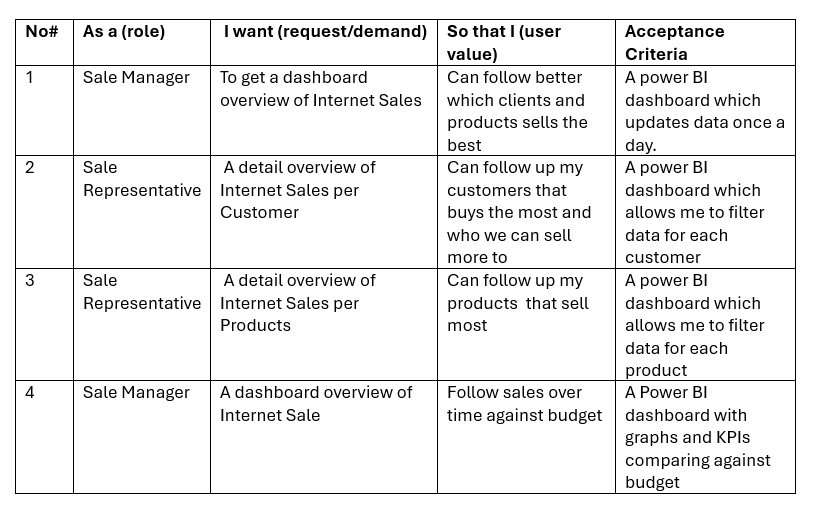
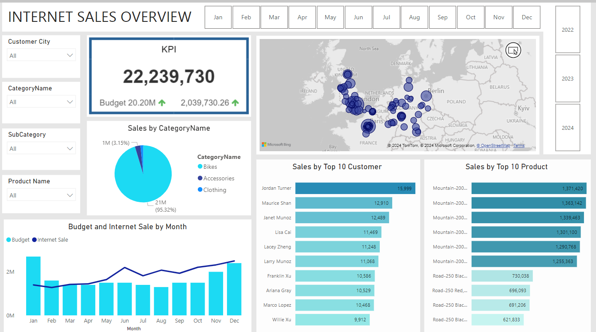
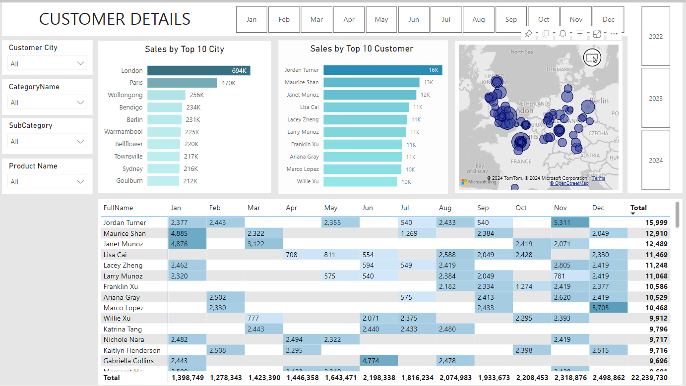
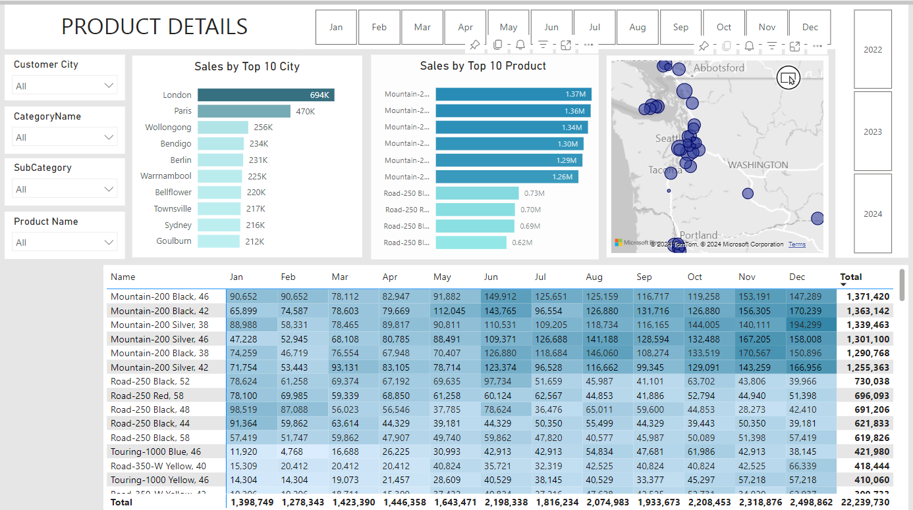

# Sale_Management_Dashboard

The "Sales Management Dashboard" project, created using Power BI, is designed to provide both an overview and detailed insights into sales performance through three main pages:

    - Overview: This page offers a high-level view of Internet sales, revenue by product, customer analysis, and other key metrics. It allows users to quickly grasp the overall business performance in a visually intuitive manner.

    - Customer Details: This page delves into the details of revenue by customer. Users can track revenue from individual customers, identify key customer groups, and analyze their purchasing trends.

    - Product Details: This page focuses on sales performance by product. It provides insights into the sales of each product, helping users identify best-selling items and adjust their business strategies accordingly.

This dashboard not only helps businesses monitor their performance but also supports strategic decision-making based on real-time data.

## User Stories

## Data Model

## Dashboard

